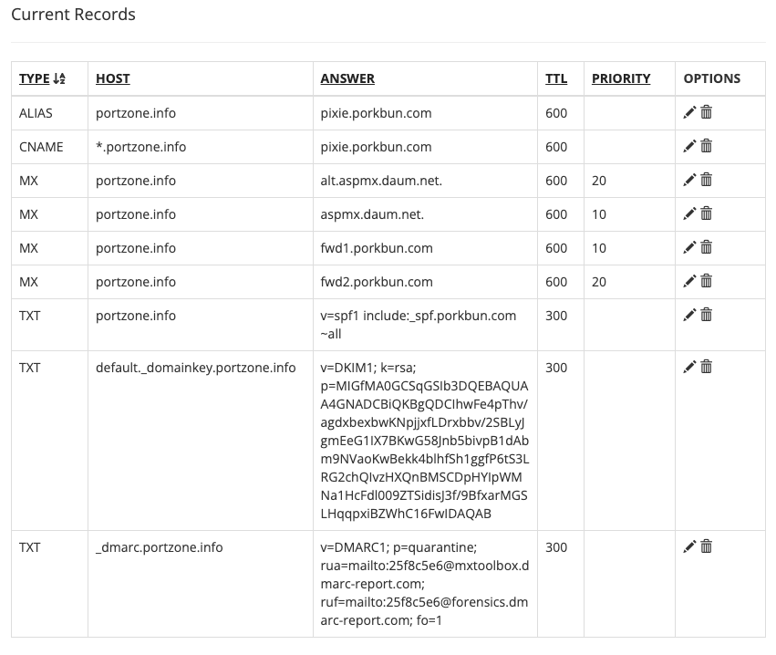

---
tags:
  - Engineering
  - IssueNote
  - DNS
  - DevOps
title: porkbun 다음 스마트워크 설정 방법
created: '2023-05-24 10:56'
modified: '2023-05-24 10:58'
aliases: null
my_rate: null
slug: porkbun-다음-스마트워크-설정-방법
---

# Intro

아래의 DNS 클릭

MX 추가

다음과 같이 다음 설정

# Reference

# 연결문서
- [[Docker 사용시 Error connect ECONNREFUSED 오류]]
- [[Elastic Beanstalk Enviroment 끄기]]
- [[Elastic Beanstalk 메모리 스왑하기]]
