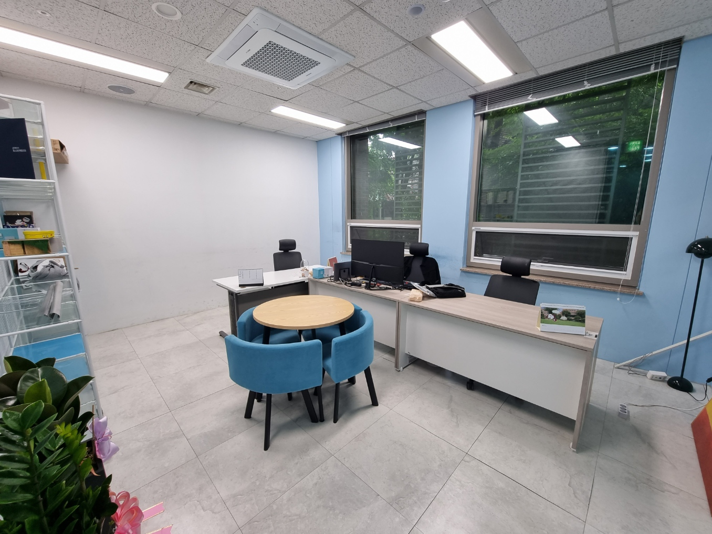
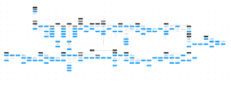
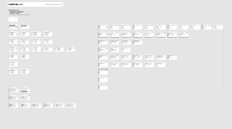

# 개요

지난 5 월 4 일, 사업자 등록 이후로 벌써 70 일이라는 시간이 흘러갔다. 이렇게 흘러간 시간이 많지만, 이를 기록한 회고가 없어, 언젠가 써야지 하던 찰나.

링크드인에서 같은 ROTC 후배가 쌓아온 회고록을 보고, 나또한 회고로 나의 삶을 기록해야될 필요성을 느꼈다.

아마 순서는 현재의 일을 쓸 수도 있고, 과거의 일을 차근이 되짚어보는 순간이 될수도 있다. 일단 이번 글은 현재의 이야기를 담을 것이다.

# 회사 생활

사실 회사 생활이라고 하면 아직 쪽팔린다. 시작한지 얼마 되지 않아서 체계도 갖춰져있지 않고, 출퇴근 시간도 출근 10 시, 퇴근 6 시 이지만 개인 사정에 따라서 수시로 바뀐다.

주로 출근 시간은 아침 운동을 하고 와서 11 시 이후로 늦춰질 때가 많고, 퇴근시간도 9 시까지 늦춰질 때가 많다.

아래는 사무실의 초기 모습이다. 지금만 해도 꽤 많이 바뀌었다.

그래도 나름대로 사무실 구색도 갖추고 있고 일할 맛이 나는 공간이 있으니 괜찮은 느낌이 든다. 내 자리는 모니터가 있는 중앙의 자리다.

이 곳에서 나는 열심히 피그마를 만지다가 코드도 만지고 서비스 개발을 하고 있다. 점심은 주로 뒤쪽으로 나가, 몇군데 없는 밥집 중 하나로 가서 법카로 결제하며 먹고 있다.

뭐, 더 특이한 일은 일어나지 않는다.

# 서비스 개발의 고난

요새 고민이라고 한다면 서비스 개발 자체가 상당히 고되다는 것이다. 나는 주력 업무가 개발이다보니, 기획쪽은 영 까막눈이다. 초기에는 되다만 개발 문서들을 만들어놓고, 디자인 외주 업무는 대표이사 친구에게 맡겨두고, 나는 서버 개발부터 전념하려고 했다.

초기에는 이 전략이 먹혀들어가는 느낌이었다. 하지만 디자인 외주를 줄 때 내가 간과한 것은 디자인 작업도 기획이 필요하다는 것이었다.

일단 가장 처음으로 필요했던 것은 Information Architecture(?) 아무튼 IA 를 만들어야했는데, 이것은 그나마 기획과 관련된 영상을 많이 봐서 나름대로 열심히 만들어둘 수는 있었다.

그러나 IA 를 넘기고 기뻐하던 것도 잠시. 이번에는 화면설계서를 만들어야 했다. 화면설계서는 진짜로 처음이었기에, 공동창업자와 나는 결심했다. 기획자를 모집하기로.

나는 기획자가 어느정도 감을 잡을 수 있게 화면설계서 2~3 페이지를 만들어두었고, 잠시 뒤 기획자를 영입하러 갔던 공동창업자가 되돌아왔다. 잘 안됐단다.

우리는 외주 기획자도 알아보았지만, 1 페이지에 2~3 만원 정도의 가격이라는 것을 듣고는 그냥 내가 직접 만들기로 결심하였다.

초기에 너무나 많이 헤메었다. 그나마 레퍼런스 문서도 보고 내가 다룰줄 아는 피그마로도 화면설계서를 만들수 있다는 것을 알아서 열심히 그럴듯하게 화면설계서를 제작하기 시작했고, 현재는 절반이 넘는 페이지가 완성되었다!

그러나 초기에 서비스 개발에서 예상했던 일정이 계속해서 지연되고 있으므로 최대한 스퍼트를 내야한다. 부디 우리 서비스가 일정에 맞게 출시되기를 빈다.

---

# 마치며

별로 한 이야기도 없는데 벌써 마치는 기분이지만, 천리길도 한걸음부터다. 앞으로도 최대한 많이 회고를 쓰면서 나 자신을 되돌아보고, 이를 공유하고자 한다.

그리고 혹시 아는가. 이 회고들이 모여 나의 자서전이 될지.

# Reference

- https://www.posco.co.kr/

# 연결문서
- [창업 최대의 고난 - 공동 창업자 만나기 -](/post/changeop-choedaeui-gonan-gongdong-changeopja-mannagi)
- [스타트업 시작부터 투자를 받기까지](/post/seutateueop-sijakbuteo-tujareul-batgikkaji)
- [외주 프로젝트는 어떻게 실패했는가](/post/oeju-peurojekteuneun-eotteoke-silpaehaenneunga)
